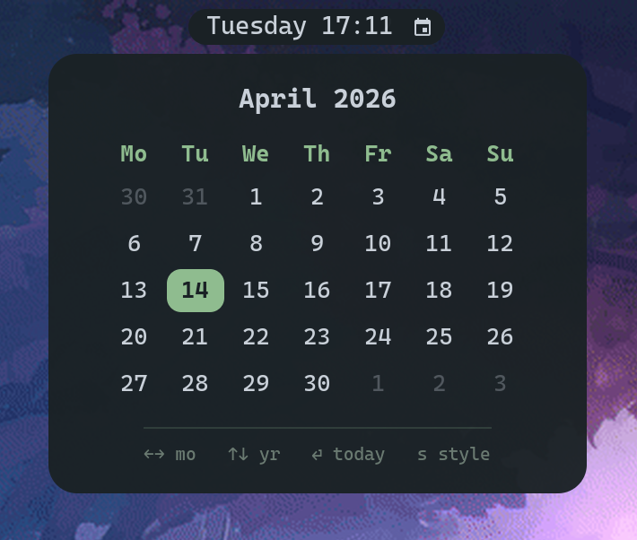

# waycal

A tiny calendar popup for Waybar. Click an icon in the bar, a small month view drops down under the bar, arrow keys navigate, Esc closes. That's it.

Written in Rust with GTK4 and `gtk4-layer-shell` so the popup anchors itself to the top of the screen via the Wayland layer-shell protocol — no compositor config needed.

<p align="center">
  
  &nbsp;&nbsp;
  
</p>

## Features

- **Month view** with today highlighted, leading/trailing days dimmed
- **Keyboard nav:** `←`/`→` month, `↑`/`↓` year, `Enter` today, `s` toggle style, `Esc` close
- **Two looks:** press `s` to swap between a sharp-cornered, bordered "Omarchy" style and a soft rounded style. Your choice is remembered between launches
- **Toggle-click:** clicking the Waybar icon while the popup is open closes it
- **Anchored** just below the bar, horizontally centered, no config file hacks
- **Dark theme** with a sage-green accent, monospace font. Self-contained CSS — no theme integration or external dependencies to worry about.

## Requirements

waycal is a small native app, not a Waybar plugin. It runs on any Linux desktop that has:

- A **Wayland compositor supporting `wlr-layer-shell`**
  — Hyprland, Sway, river, Wayfire, Hikari, LabWC, etc. (not GNOME or KDE — those don't implement layer-shell)
- **Waybar** (for the click-to-launch integration)
- **GTK4** and **gtk4-layer-shell** shared libraries (already pulled in by most of the above compositors' package sets)
- A **Nerd Font** installed as a system font, so the Waybar icon glyph renders. CaskaydiaMono Nerd Font is the default in Omarchy and works out of the box.

It is distribution-agnostic. The instructions below use `cargo`, which works on Arch, Fedora, Debian/Ubuntu, NixOS, etc.

## Install

### Arch / Omarchy (AUR)

```sh
yay -S waycal
```

Or with any other AUR helper (`paru -S waycal`), or manually via `git clone https://aur.archlinux.org/waycal.git && cd waycal && makepkg -si`.

### Any distro with Rust installed

```sh
cargo install waycal
```

This pulls the latest release from [crates.io](https://crates.io/crates/waycal), builds it, and drops the binary into `~/.cargo/bin/waycal`. Make sure that directory is on your `$PATH`. You'll also need the GTK4 + `gtk4-layer-shell` development headers installed so cargo can link against them:

| Distro             | Install command                                                                   |
| ------------------ | --------------------------------------------------------------------------------- |
| Arch / Omarchy     | `sudo pacman -S --needed gtk4 gtk4-layer-shell pkgconf`                           |
| Fedora             | `sudo dnf install gtk4-devel gtk4-layer-shell-devel pkgconf`                      |
| Debian / Ubuntu    | `sudo apt install libgtk-4-dev libgtk4-layer-shell-dev pkg-config`                |

### Prebuilt binary

Each tagged release ships a prebuilt x86_64 Linux tarball on the [releases page](https://github.com/forrestknight/waycal/releases). Extract it and drop `waycal` anywhere on your `$PATH`.

### Build from source

```sh
git clone https://github.com/forrestknight/waycal.git
cd waycal
cargo build --release
install -Dm755 target/release/waycal ~/.local/bin/waycal
```

## Waybar integration

Add a custom module to your `~/.config/waybar/config.jsonc`:

```jsonc
"custom/waycal": {
  "format": "󰃭",
  "on-click": "pkill -x waycal || waycal",
  "tooltip-format": "Calendar"
}
```

Reference it in one of your `modules-*` lists, e.g. right after the clock:

```jsonc
"modules-center": ["clock", "custom/waycal", ...]
```

Optional styling in `~/.config/waybar/style.css`:

```css
#custom-waycal {
    background-color: @background;
    color: @foreground;
    padding: 0 10px;
    margin: 5px 0;
    border-radius: 16px;
    font-size: 12px;
}
#custom-waycal:hover {
    background-color: alpha(@background, 0.7);
}
```

Restart Waybar (`pkill -x waybar && setsid waybar &`) and click the icon.

## Controls

| Key          | Action                                     |
| ------------ | ------------------------------------------ |
| `←` / `→`    | Previous / next month                      |
| `↑` / `↓`    | Previous / next year                       |
| `Enter`      | Jump back to today                         |
| `s`          | Toggle sharp / rounded style (persisted)   |
| `Esc`        | Close the popup                            |

Clicking the Waybar icon a second time also closes the popup (the `pkill -x waycal || waycal` command toggles).

## Why not just use the Waybar clock tooltip?

The built-in `clock` tooltip shows a calendar, but it's an HTML label tooltip — not focusable, not keyboard-navigable, and shares the clock module's click action. waycal is a real window you can interact with, and leaves your clock's click behavior untouched.

## License

MIT.
