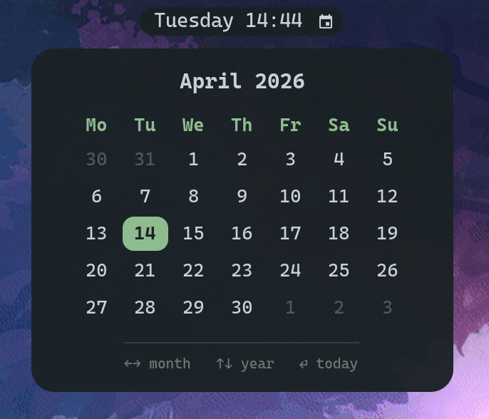

# omacal

A tiny calendar popup for Waybar. Click an icon in the bar, a small month view drops down under the bar, arrow keys navigate, Esc closes. That's it.

Written in Rust with GTK4 and `gtk4-layer-shell` so the popup anchors itself to the top of the screen via the Wayland layer-shell protocol — no compositor config needed.



## Features

- **Month view** with today highlighted, leading/trailing days dimmed
- **Keyboard nav:** `←`/`→` month, `↑`/`↓` year, `Enter` today, `Esc` close
- **Toggle-click:** clicking the Waybar icon while the popup is open closes it
- **Anchored** just below the bar, horizontally centered, no config file hacks
- **Dark theme** with a sage-green accent, monospace font. Self-contained CSS — no theme integration or external dependencies to worry about.

## Requirements

omacal is a small native app, not a Waybar plugin. It runs on any Linux desktop that has:

- A **Wayland compositor supporting `wlr-layer-shell`**
  — Hyprland, Sway, river, Wayfire, Hikari, LabWC, etc. (not GNOME or KDE — those don't implement layer-shell)
- **Waybar** (for the click-to-launch integration)
- **GTK4** and **gtk4-layer-shell** shared libraries (already pulled in by most of the above compositors' package sets)
- A **Nerd Font** installed as a system font, so the Waybar icon glyph renders. CaskaydiaMono Nerd Font is the default in Omarchy and works out of the box.

It is distribution-agnostic. The instructions below use `cargo`, which works on Arch, Fedora, Debian/Ubuntu, NixOS, etc.

## Install

You need the Rust toolchain (`rustup` or your distro's `rust` + `cargo` packages) and GTK4 + layer-shell development headers.

### Arch / Omarchy

```sh
sudo pacman -S --needed rust gtk4 gtk4-layer-shell pkgconf
```

### Fedora

```sh
sudo dnf install rust cargo gtk4-devel gtk4-layer-shell-devel pkgconf
```

### Debian / Ubuntu

```sh
sudo apt install rustc cargo libgtk-4-dev libgtk4-layer-shell-dev pkg-config
```

Then build and install the binary:

```sh
git clone https://github.com/forrestknight/omacal.git
cd omacal
cargo install --path .
```

`cargo install` drops the compiled binary into `~/.cargo/bin/omacal`. Make sure that directory is on your `$PATH`.

## Waybar integration

Add a custom module to your `~/.config/waybar/config.jsonc`:

```jsonc
"custom/omacal": {
  "format": "󰃭",
  "on-click": "pkill -x omacal || omacal",
  "tooltip-format": "Calendar"
}
```

Reference it in one of your `modules-*` lists, e.g. right after the clock:

```jsonc
"modules-center": ["clock", "custom/omacal", ...]
```

Optional styling in `~/.config/waybar/style.css`:

```css
#custom-omacal {
    background-color: @background;
    color: @foreground;
    padding: 0 10px;
    margin: 5px 0;
    border-radius: 16px;
    font-size: 12px;
}
#custom-omacal:hover {
    background-color: alpha(@background, 0.7);
}
```

Restart Waybar (`pkill -x waybar && setsid waybar &`) and click the icon.

## Controls

| Key          | Action                |
| ------------ | --------------------- |
| `←` / `→`    | Previous / next month |
| `↑` / `↓`    | Previous / next year  |
| `Enter`      | Jump back to today    |
| `Esc`        | Close the popup       |

Clicking the Waybar icon a second time also closes the popup (the `pkill -x omacal || omacal` command toggles).

## Why not just use the Waybar clock tooltip?

The built-in `clock` tooltip shows a calendar, but it's an HTML label tooltip — not focusable, not keyboard-navigable, and shares the clock module's click action. omacal is a real window you can interact with, and leaves your clock's click behavior untouched.

## License

MIT.
